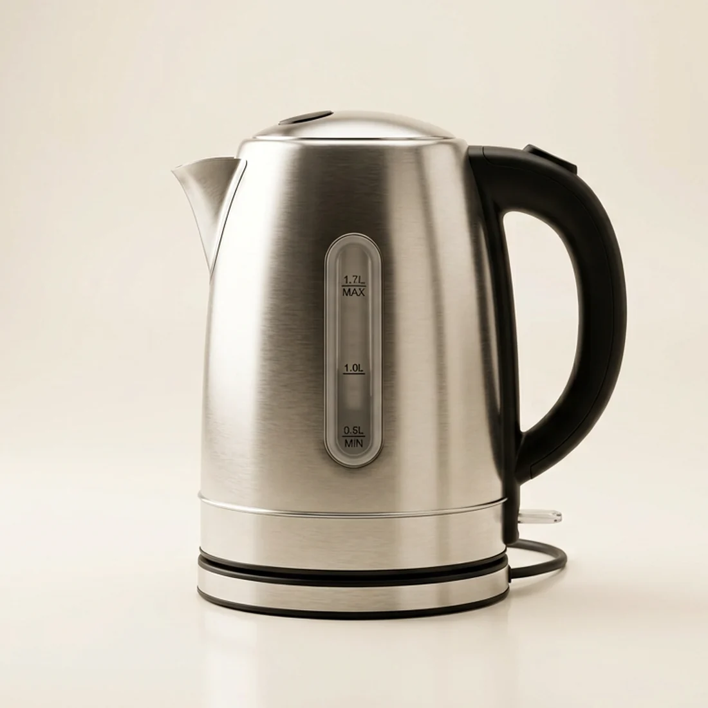

# Chikwafu — Electric Appliances Storefront

A production-ready e-commerce storefront for **Chikwafu Appliances**, a Ugandan retailer of
electric home appliances. Built with React, TypeScript, Vite and Tailwind CSS.



## Features

- **Striking home page** — editorial hero, featured collections by room, promo block, bestsellers,
  customer testimonials and newsletter capture.
- **Product grid with filters & sorting** — filter by category, brand, max price (range slider),
  minimum rating, on-offer and in-stock toggles; sort by featured, price, rating or name.
  All filter state lives in the URL, so any view is shareable and back-button friendly.
- **Rich product detail pages** — multi-angle image gallery, spec tables, highlight lists,
  a rating-distribution histogram and filterable verified reviews.
- **Slide-out cart** — spring-animated drawer with quantity controls, free-delivery progress bar,
  coupon display and live totals.
- **Streamlined checkout** — three steps (delivery → payment → review) with per-field validation,
  Ugandan district selection, and dynamic delivery pricing.
- **Ugandan market fit** — UGX pricing throughout, MTN Mobile Money / Airtel Money / card /
  cash-on-delivery, district-based delivery fees, and locally-grounded copy and reviews.
- **Persistent state** — cart and wishlist survive reloads via `zustand/persist` (localStorage).
- **Fully responsive** — bottom-sheet filters and a slide-in nav drawer on mobile.
- **Accessible** — semantic landmarks, ARIA labels, keyboard-dismissable overlays,
  visible focus rings and a `prefers-reduced-motion` fallback.

## Tech stack

| Concern | Choice |
| --- | --- |
| Framework | React 19 + TypeScript |
| Build | Vite 8 |
| Styling | Tailwind CSS 3 (custom design tokens) |
| State | Zustand with `persist` middleware |
| Animation | Framer Motion |
| Icons | Lucide |
| Routing | React Router 7 |

## Getting started

```bash
npm install
npm run dev      # http://localhost:5173
npm run build    # production bundle to dist/
npm run preview  # serve the production build
```

## Catalog

The catalogue in `src/lib/catalog.ts` combines:

- **Core appliances** — ten appliances across five categories with realistic UGX pricing,
  specifications, warranty terms, stock levels and hand-written customer reviews from
  locations around Uganda.
- **Ayne Kampala range (Aug 2026)** — 1,500+ gadgets imported from the Ayne Kampala store
  (ayne.ug, Aponye Complex): wearables, audio, cables & chargers, power banks, gaming,
  cameras, fans, grooming, car accessories and more. Real store/brand product photos live in
  `public/ayne/` (square webp, 800px). Listings carry Ayne's UGX prices, feature bullets and
  12-month warranty terms. Prices carry the standard 10% Chikwafu margin over
  Ayne's list price (rounded to the nearest 1,000 UGX), same convention as the
  core appliance range.
- **JBL official range (Aug 2026)** — 130 products imported from the JBL Online Store
  (jblonlinestore.com.my): portable speakers, soundbars, party speakers, headphones, earbuds,
  gaming audio, microphones and accessories. Real product photos live in `public/jbl/`.
  Prices are the store's MYR price converted to UGX (1 MYR ≈ 929 UGX, 29 Aug 2026) plus the
  standard 10% Chikwafu margin, rounded to the nearest 1,000 UGX.

**Promo codes:** `KARIBU10` (10% off) · `CHIKWAFU5` (5% off)

Delivery is free on orders above UGX 1,500,000; otherwise UGX 15,000 within
Kampala/Wakiso/Mukono and UGX 45,000 upcountry.

## Project structure

```
src/
├── components/   Header, Footer, CartDrawer, ProductCard, Stars, Logo
├── pages/        Home, Shop, ProductDetail, Checkout, OrderConfirmed, NotFound
├── store/        cart.ts (persisted), wishlist.ts (persisted)
└── lib/          catalog.ts (seed data), types.ts, format.ts
```

## Note

This is a demonstration storefront. Checkout simulates payment authorisation — no gateway is
called and no real transaction occurs. To go live, wire the `placeOrder` handler in
`src/pages/Checkout.tsx` to a payment provider such as Flutterwave, Pesapal or MTN MoMo's
Collections API.

## Licence

MIT
